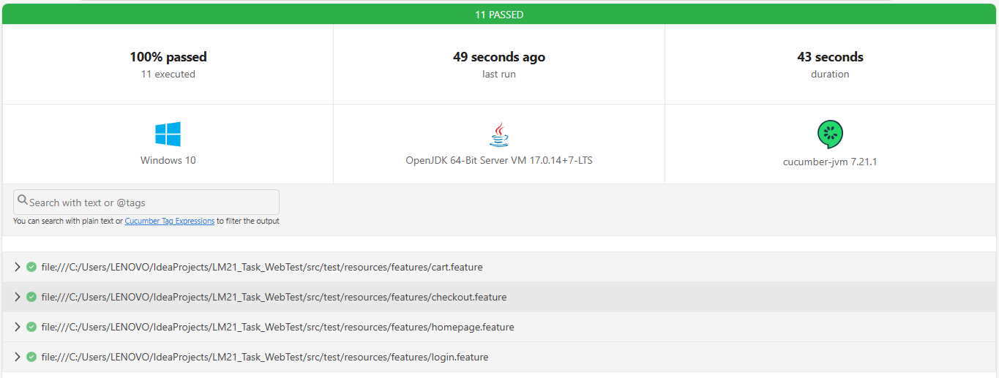

# Web UI Automation Framework

## Tujuan Pengujian

Bertujuan membangun kerangka kerja pengujian UI Web otomatis menggunakan Cucumber, Java, Gradle, dan Selenium. Framework ini dirancang untuk menguji fungsionalitas aplikasi web secara efisien dan konsisten melalui skenario positif, negatif, dan boundary. 

Dengan menerapkan Page Object Model (POM), pengujian menjadi lebih terstruktur dan mudah dipelihara. Cucumber digunakan untuk menulis skenario uji dalam bahasa alami (Gherkin), Selenium untuk interaksi dengan browser, Java sebagai bahasa utama, dan Gradle untuk manajemen dependensi serta otomatisasi proses pengujian.

## Persyaratan

Sebelum menjalankan proyek ini, pastikan Anda memiliki hal berikut:

- Java JDK 11 atau lebih baru
- Gradle 6.0 atau lebih baru
- IDE (seperti IntelliJ IDEA)

## Penyiapan dan Konfigurasi

1. **Clone Repositori**
   ```bash
   git clone https://github.com/zeeuuu/UIWebAutomation.git
   cd UIWebAutomation
   ```
2. **Instalasi Depedensi**
    <br>Jalankan perintah berikut untuk mengunduh semua dependensi yang diperlukan:
    ```bash
   gradle build
   ```
3. **Menjalankan Pengujian**
   <br>Untuk menjalankan pengujian, gunakan perintah berikut:
    ```bash
   gradle test
   ```
   
## Struktur Proyek

- **'src/test/java/webUIAutomation/page/'**: Berisi kelas-kelas yang merepresentasikan halaman aplikasi.
- **'src/test/java/webUIAutomation/stepDef/'**: Berisi langkah-langkah yang diimplementasikan untuk setiap skenario pengujian.
- **'src/test/resources/features/'**: Berisi file fitur Gherkin yang mendefinisikan skenario pengujian.
- **'src/test/java/webUIAutomation/RunnerTest.java'**: Kelas yang digunakan untuk menjalankan pengujian Cucumber.

## Contoh Kasus Uji

Proyek ini menggunakan website ``saucedemo.com``. Yang mencakup beberapa contoh kasus uji, termasuk:
- **login.feature**: Menguji proses login pengguna.
- **homepage.feature**: Menguji proses penambahan item pada keranjang.
- **cart.feature**: Menguji proses validasi input pengguna sebelum checkout.
- **checkout.feature**: Menguji proses checkout dengan item di keranjang.

## Hasil Pengujian



## Kontribusi

Jika Anda ingin berkontribusi pada proyek ini, silakan buat fork repositori ini dan kirimkan pull request dengan perubahan Anda.

